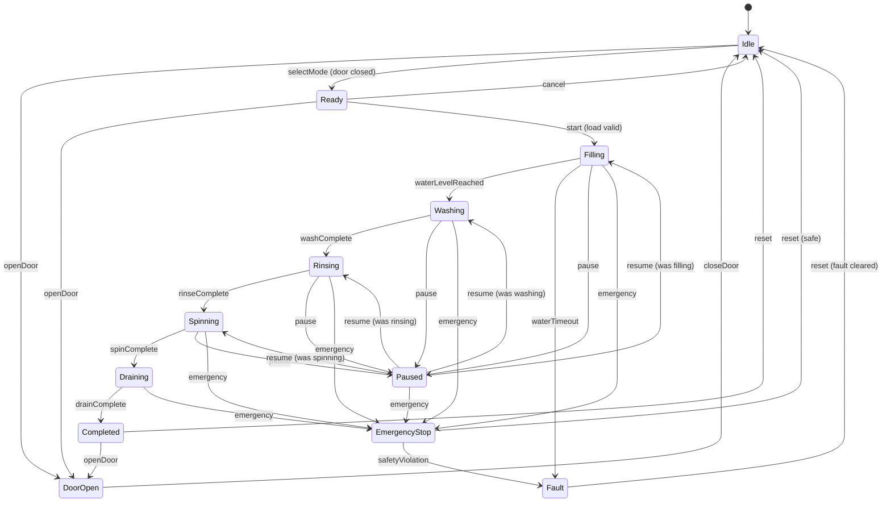

# High-Level Design (HLD) - Washing Machine Simulator

## 1. Document Information

| Item         | Details                   |
| ------------ | ------------------------- |
| Project Name | Washing Machine Simulator |
| Version      | 1.0.0                     |
| Author       | Kaushlendra Kumar         |
| Date         | February 2025             |
| Language     | C++17                     |
| Build System | CMake                     |

---

## 2. Project Overview

### 2.1 Purpose

A software simulation of a consumer washing machine that validates logic, concurrency handling, and event-driven control flow without physical hardware.

### 2.2 Scope

- Simulate realistic state transitions
- Implement safety interlocks
- Support multiple wash modes
- Handle emergency scenarios
- Manage water system simulation

### 2.3 Key Features

1. Front Door System with safety interlocks
2. Four wash modes (Quick Wash, Normal, Heavy, Delicate)
3. Emergency stop functionality
4. Capacity management (0-6 kg)
5. Self water replenishing system
6. Event-driven architecture
7. Interactive CLI interface

---

## 3. System Architecture

### 3.1 Architecture Diagram

```
┌─────────────────────────────────────────────────────────────────┐
│                    WASHING MACHINE SIMULATOR                     │
├─────────────────────────────────────────────────────────────────┤
│                                                                  │
│  ┌──────────────┐    ┌──────────────┐    ┌──────────────┐       │
│  │   CLI        │    │   Event      │    │   Config     │       │
│  │   Interface  │───▶│   Engine     │◀───│   Manager    │       │
│  └──────────────┘    └──────┬───────┘    └──────────────┘       │
│                             │                                    │
│                             ▼                                    │
│                    ┌──────────────┐                              │
│                    │    State     │                              │
│                    │   Machine    │                              │
│                    └──────┬───────┘                              │
│                           │                                      │
│         ┌─────────────────┼─────────────────┐                   │
│         ▼                 ▼                 ▼                   │
│  ┌──────────────┐  ┌──────────────┐  ┌──────────────┐          │
│  │    Door      │  │    Water     │  │    Motor     │          │
│  │   System     │  │   System     │  │   System     │          │
│  └──────────────┘  └──────────────┘  └──────────────┘          │
│                                                                  │
└─────────────────────────────────────────────────────────────────┘
```

### 3.2 Component Overview

| Component      | Responsibility                                            |
| -------------- | --------------------------------------------------------- |
| CLI Interface  | User input handling, command parsing, display output      |
| Event Engine   | Event queue management, event dispatch, async handling    |
| Config Manager | Load wash modes from JSON, manage settings                |
| State Machine  | State transitions, transition validation, state callbacks |
| Door System    | Door sensor simulation, lock mechanism, safety checks     |
| Water System   | Water level management, inlet valve, reservoir, alarms    |
| Motor System   | Spin speed control, drum rotation simulation              |

---

## 4. State Machine Design

### 4.1 State Diagram



### 4.2 State Descriptions

| State         | Description                   | Entry Actions            | Exit Actions      |
| ------------- | ----------------------------- | ------------------------ | ----------------- |
| Idle          | Machine powered on, waiting   | Display ready            | None              |
| DoorOpen      | Door is open                  | Unlock door              | None              |
| Ready         | Mode selected, ready to start | Display mode info        | None              |
| Filling       | Water filling in progress     | Open inlet valve         | Close inlet valve |
| Washing       | Main wash cycle               | Start motor, set temp    | Stop motor        |
| Rinsing       | Rinse cycle                   | Start motor, fresh water | Stop motor        |
| Spinning      | Spin dry cycle                | High speed motor         | Reduce speed      |
| Draining      | Water draining                | Open drain valve         | Close drain valve |
| Completed     | Cycle finished                | Unlock door, beep        | None              |
| Paused        | Cycle paused                  | Stop all operations      | None              |
| EmergencyStop | Emergency activated           | Stop all, assess safety  | None              |
| Fault         | System fault detected         | Display error, lock      | Clear fault       |

### 4.3 State Transition Rules

```
SAFETY RULES:
1. Cannot start if door is open
2. Cannot open door during active cycle (Filling, Washing, Rinsing, Spinning, Draining)
3. Cannot start if load > 6 kg
4. Cannot start if water reservoir empty
5. Emergency stop accessible from any active state
6. Door unlocks only when safe (no water, motor stopped)
```

---

## 5. Event-Driven Architecture

### 5.1 Event Types

| Event Category | Events                                                                            |
| -------------- | --------------------------------------------------------------------------------- |
| User Events    | START, STOP, PAUSE, RESUME, EMERGENCY, SELECT_MODE, OPEN_DOOR, CLOSE_DOOR         |
| System Events  | WATER_LEVEL_REACHED, WASH_COMPLETE, RINSE_COMPLETE, SPIN_COMPLETE, DRAIN_COMPLETE |
| Timer Events   | CYCLE_TIMEOUT, FILL_TIMEOUT                                                       |
| Sensor Events  | DOOR_OPENED, DOOR_CLOSED, OVERLOAD_DETECTED, WATER_LOW                            |
| Fault Events   | WATER_UNAVAILABLE, MOTOR_FAULT, DOOR_FAULT                                        |

### 5.2 Event Flow

```
┌─────────┐     ┌─────────────┐     ┌─────────────┐     ┌──────────┐
│  User   │────▶│   Event     │────▶│   State     │────▶│  Action  │
│  Input  │     │   Queue     │     │   Machine   │     │  Handler │
└─────────┘     └─────────────┘     └─────────────┘     └──────────┘
                      ▲                                       │
                      │                                       │
                      └───────────────────────────────────────┘
                              (Generated Events)
```

---

## 6. Subsystem Design

### 6.1 Door System

```
┌─────────────────────────────────┐
│         DOOR SYSTEM             │
├─────────────────────────────────┤
│ - isOpen: bool                  │
│ - isLocked: bool                │
├─────────────────────────────────┤
│ + open(): bool                  │
│ + close(): bool                 │
│ + lock(): void                  │
│ + unlock(): void                │
│ + canOpen(): bool               │
│ + getStatus(): DoorStatus       │
└─────────────────────────────────┘

Safety Interlock Logic:
- canOpen() returns false if machine is in active cycle
- lock() called automatically when cycle starts
- unlock() called only when motor stopped AND water drained
```

### 6.2 Water System

```
┌─────────────────────────────────┐
│         WATER SYSTEM            │
├─────────────────────────────────┤
│ - currentLevel: float           │
│ - targetLevel: float            │
│ - reservoirLevel: float         │
│ - inletValveOpen: bool          │
│ - drainValveOpen: bool          │
├─────────────────────────────────┤
│ + startFilling(target): void    │
│ + stopFilling(): void           │
│ + startDraining(): void         │
│ + stopDraining(): void          │
│ + checkReservoir(): bool        │
│ + autoReplenish(): void         │
│ + getCurrentLevel(): float      │
└─────────────────────────────────┘

Auto-Replenish Logic:
- If reservoirLevel < threshold, attempt replenish
- If replenish fails, raise WATER_UNAVAILABLE fault
```

### 6.3 Motor System

```
┌─────────────────────────────────┐
│         MOTOR SYSTEM            │
├─────────────────────────────────┤
│ - currentSpeed: int             │
│ - targetSpeed: int              │
│ - isRunning: bool               │
│ - direction: Direction          │
├─────────────────────────────────┤
│ + start(speed, dir): void       │
│ + stop(): void                  │
│ + setSpeed(rpm): void           │
│ + getSpeed(): int               │
│ + isActive(): bool              │
└─────────────────────────────────┘
```

---

## 7. Wash Mode Profiles

### 7.1 Mode Parameters

| Mode       | Duration | Spin RPM | Water Level | Temperature |
| ---------- | -------- | -------- | ----------- | ----------- |
| Quick Wash | 15 min   | 800      | 20 L        | 30°C        |
| Normal     | 45 min   | 1000     | 35 L        | 40°C        |
| Heavy      | 60 min   | 1200     | 45 L        | 60°C        |
| Delicate   | 30 min   | 400      | 30 L        | 30°C        |

### 7.2 Load-Based Adjustments

```
Water Level Adjustment:
- Base water = mode.waterLevel
- Adjusted water = Base + (load_kg * 3)

Cycle Time Adjustment:
- Base time = mode.duration
- Adjusted time = Base + (load_kg * 2) minutes
```

---

## 8. Safety Requirements

### 8.1 Safety Interlocks

| Interlock   | Condition       | Action                     |
| ----------- | --------------- | -------------------------- |
| Door Lock   | Cycle active    | Prevent door open          |
| Overload    | Load > 6 kg     | Prevent start              |
| Water Check | Reservoir empty | Raise fault                |
| Emergency   | Button pressed  | Immediate stop, safe state |

### 8.2 Emergency Stop Sequence

```
1. EMERGENCY event received
2. Stop motor immediately
3. Close inlet valve
4. Execute drain policy (configurable)
5. Wait for safe conditions
6. Unlock door
7. Transition to EmergencyStop state
```

---

## 9. User Interface

### 9.1 CLI Commands

| Command    | Description            |
| ---------- | ---------------------- |
| open       | Open door              |
| close      | Close door             |
| load <kg>  | Set load weight        |
| mode <1-4> | Select wash mode       |
| start      | Start cycle            |
| pause      | Pause cycle            |
| resume     | Resume cycle           |
| stop       | Stop/cancel cycle      |
| emergency  | Emergency stop         |
| status     | Display current status |
| help       | Show commands          |
| exit       | Exit simulator         |

### 9.2 Display Format

```
╔════════════════════════════════════════╗
║     WASHING MACHINE SIMULATOR          ║
╠════════════════════════════════════════╣
║ State: WASHING                         ║
║ Mode: Normal                           ║
║ Load: 3.5 kg                           ║
║ Water Level: 35/40 L                   ║
║ Motor Speed: 1000 RPM                  ║
║ Progress: 45%                          ║
║ Time Remaining: 25:00                  ║
╚════════════════════════════════════════╝
```

---

## 10. File Structure

```
washing-machine/
├── CMakeLists.txt
├── config/
│   └── wash_modes.json
├── docs/
│   ├── HLD.md
│   ├── LLD.md
│   └── diagrams/
├── include/
│   ├── WashingMachine.hpp
│   ├── StateMachine.hpp
│   ├── EventEngine.hpp
│   ├── Event.hpp
│   ├── State.hpp
│   ├── DoorSystem.hpp
│   ├── WaterSystem.hpp
│   ├── MotorSystem.hpp
│   ├── ConfigManager.hpp
│   ├── WashMode.hpp
│   ├── CLI.hpp
│   └── Types.hpp
├── src/
│   ├── main.cpp
│   ├── WashingMachine.cpp
│   ├── StateMachine.cpp
│   ├── EventEngine.cpp
│   ├── DoorSystem.cpp
│   ├── WaterSystem.cpp
│   ├── MotorSystem.cpp
│   ├── ConfigManager.cpp
│   └── CLI.cpp
└── tests/
    ├── CMakeLists.txt
    ├── test_state_machine.cpp
    ├── test_door_system.cpp
    ├── test_water_system.cpp
    └── test_emergency.cpp
```

---

## 11. Technology Stack

| Component    | Technology           |
| ------------ | -------------------- |
| Language     | C++17                |
| Build System | CMake 3.16+          |
| Compiler     | GCC 15.2 (MinGW-w64) |
| Testing      | Google Test 1.14     |
| JSON Parsing | nlohmann/json        |
| IDE          | Visual Studio Code   |

---

## 12. Non-Functional Requirements

| Requirement   | Target                    |
| ------------- | ------------------------- |
| Response Time | < 100ms for user commands |
| Memory Usage  | < 50 MB                   |
| Build Time    | < 30 seconds              |
| Test Coverage | > 80%                     |
| Code Standard | C++17 compliant           |

---

## 13. Future Enhancements

1. GUI interface using Qt or ImGui
2. Network simulation for IoT features
3. Multiple machine simulation
4. Power consumption modeling
5. Noise level simulation
