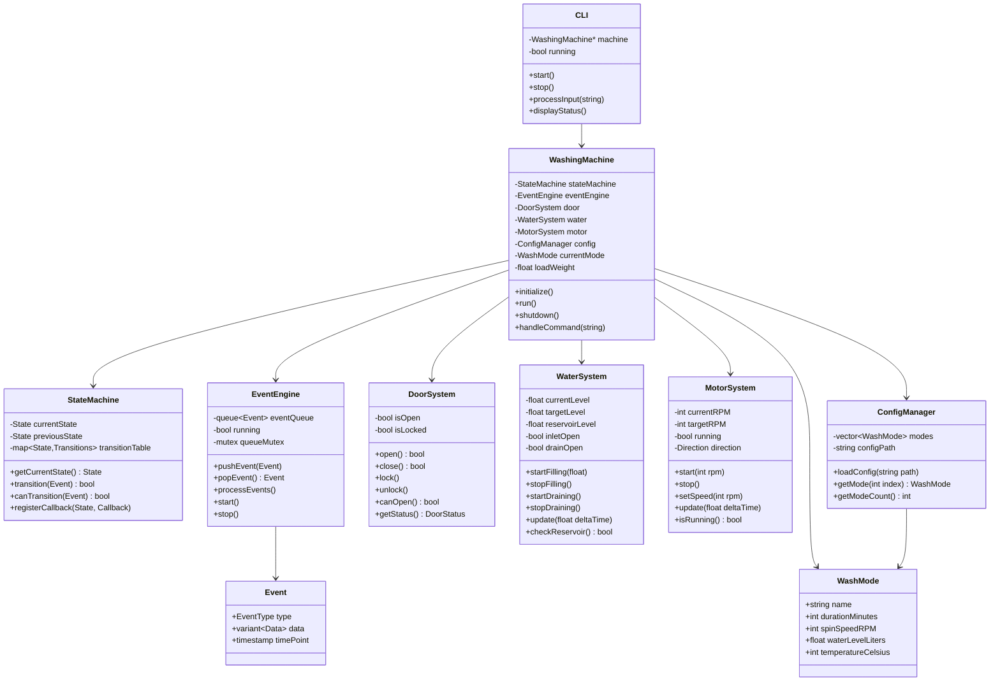
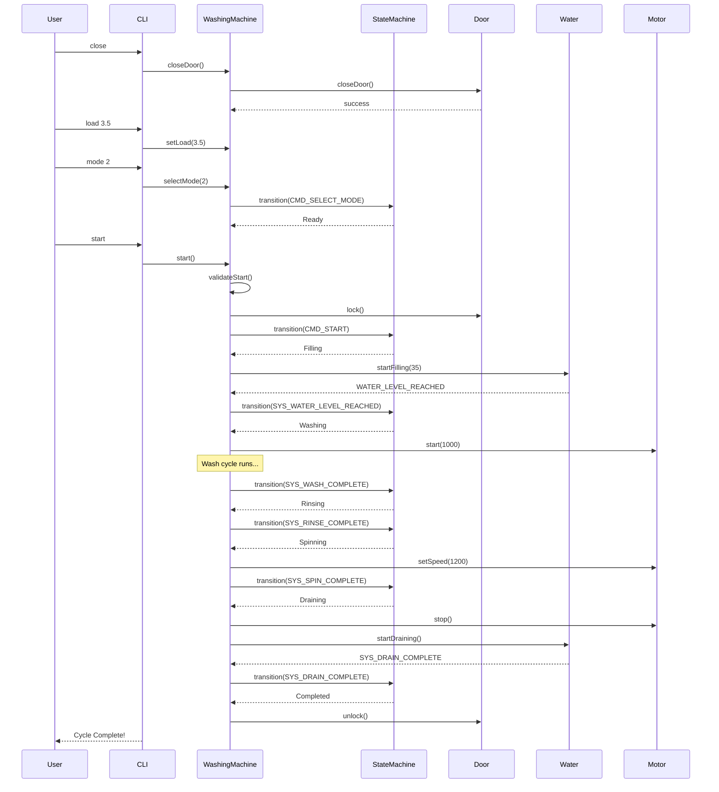
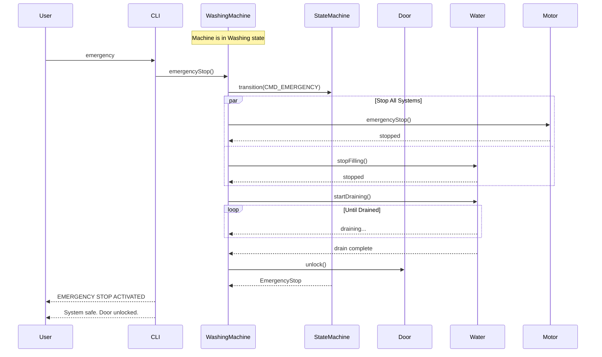

# Low-Level Design (LLD) - Washing Machine Simulator

## 1. Document Information

| Item         | Details                   |
| ------------ | ------------------------- |
| Project Name | Washing Machine Simulator |
| Version      | 1.0.0                     |
| Author       | Kaushlendra Kumar         |
| Date         | February 2025             |

---

## 2. Class Diagram



---

## 3. Detailed Class Specifications

### 3.1 Types.hpp - Common Types and Enumerations

```cpp
enum class State {
    Idle,
    DoorOpen,
    Ready,
    Filling,
    Washing,
    Rinsing,
    Spinning,
    Draining,
    Completed,
    Paused,
    EmergencyStop,
    Fault
};

enum class EventType {
    // User Events
    CMD_OPEN_DOOR,
    CMD_CLOSE_DOOR,
    CMD_SELECT_MODE,
    CMD_START,
    CMD_PAUSE,
    CMD_RESUME,
    CMD_STOP,
    CMD_EMERGENCY,
    CMD_SET_LOAD,

    // System Events
    SYS_WATER_LEVEL_REACHED,
    SYS_WASH_COMPLETE,
    SYS_RINSE_COMPLETE,
    SYS_SPIN_COMPLETE,
    SYS_DRAIN_COMPLETE,
    SYS_CYCLE_COMPLETE,

    // Timer Events
    TIMER_TICK,
    TIMER_TIMEOUT,

    // Fault Events
    FAULT_WATER_UNAVAILABLE,
    FAULT_OVERLOAD,
    FAULT_DOOR,
    FAULT_MOTOR,
    FAULT_CLEARED
};

enum class DoorStatus {
    Open,
    ClosedUnlocked,
    ClosedLocked
};

enum class Direction {
    Clockwise,
    CounterClockwise,
    Stopped
};

enum class FaultCode {
    None,
    WaterUnavailable,
    Overload,
    DoorFault,
    MotorFault,
    Timeout
};

struct SystemStatus {
    State state;
    DoorStatus doorStatus;
    float waterLevel;
    int motorRPM;
    float loadKg;
    int modeIndex;
    float progressPercent;
    int remainingSeconds;
    FaultCode fault;
};
```

### 3.2 Event.hpp

```cpp
class Event {
private:
    EventType type;
    std::variant<std::monostate, int, float, std::string> data;
    std::chrono::steady_clock::time_point timestamp;

public:
    Event(EventType type);
    Event(EventType type, int intData);
    Event(EventType type, float floatData);
    Event(EventType type, const std::string& strData);

    EventType getType() const;

    template<typename T>
    T getData() const;

    auto getTimestamp() const;
};
```

### 3.3 StateMachine.hpp

```cpp
class StateMachine {
public:
    using StateCallback = std::function<void(State, State)>;

private:
    State currentState;
    State previousState;
    State pausedFromState;
    std::map<State, std::map<EventType, State>> transitionTable;
    std::map<State, StateCallback> onEnterCallbacks;
    std::map<State, StateCallback> onExitCallbacks;

    void initializeTransitions();

public:
    StateMachine();

    State getCurrentState() const;
    State getPreviousState() const;
    State getPausedFromState() const;

    bool canTransition(EventType event) const;
    bool transition(EventType event);

    void registerOnEnter(State state, StateCallback callback);
    void registerOnExit(State state, StateCallback callback);

    std::string stateToString(State state) const;
    bool isActiveState() const;
    bool isSafeToOpenDoor() const;
};
```

### 3.4 EventEngine.hpp

```cpp
class EventEngine {
private:
    std::queue<Event> eventQueue;
    std::mutex queueMutex;
    std::condition_variable cv;
    std::atomic<bool> running;
    std::function<void(const Event&)> eventHandler;

public:
    EventEngine();
    ~EventEngine();

    void setEventHandler(std::function<void(const Event&)> handler);
    void pushEvent(const Event& event);
    void pushEvent(EventType type);

    std::optional<Event> popEvent();
    bool hasEvents() const;
    void clear();

    void start();
    void stop();
    bool isRunning() const;
};
```

### 3.5 DoorSystem.hpp

```cpp
class DoorSystem {
private:
    bool open;
    bool locked;
    std::function<void(EventType)> eventCallback;

public:
    DoorSystem();

    void setEventCallback(std::function<void(EventType)> callback);

    bool openDoor();
    bool closeDoor();
    void lock();
    void unlock();

    bool isOpen() const;
    bool isLocked() const;
    bool canOpen() const;
    DoorStatus getStatus() const;

    std::string getStatusString() const;
};
```

### 3.6 WaterSystem.hpp

```cpp
class WaterSystem {
private:
    float currentLevel;
    float targetLevel;
    float reservoirLevel;
    float maxReservoir;
    float fillRate;
    float drainRate;
    bool inletValveOpen;
    bool drainValveOpen;
    float lowThreshold;
    std::function<void(EventType)> eventCallback;

public:
    WaterSystem();

    void setEventCallback(std::function<void(EventType)> callback);

    void startFilling(float targetLiters);
    void stopFilling();
    void startDraining();
    void stopDraining();

    void update(float deltaTimeSeconds);

    bool checkReservoir() const;
    bool autoReplenish();

    float getCurrentLevel() const;
    float getTargetLevel() const;
    float getReservoirLevel() const;
    bool isFilling() const;
    bool isDraining() const;

    void reset();
};
```

### 3.7 MotorSystem.hpp

```cpp
class MotorSystem {
private:
    int currentRPM;
    int targetRPM;
    bool running;
    Direction direction;
    int rampRate;
    std::function<void(EventType)> eventCallback;

public:
    MotorSystem();

    void setEventCallback(std::function<void(EventType)> callback);

    void start(int rpm, Direction dir = Direction::Clockwise);
    void stop();
    void setSpeed(int rpm);
    void setDirection(Direction dir);

    void update(float deltaTimeSeconds);

    int getCurrentRPM() const;
    int getTargetRPM() const;
    bool isRunning() const;
    Direction getDirection() const;

    void emergencyStop();
    void reset();
};
```

### 3.8 WashMode.hpp

```cpp
struct WashMode {
    std::string name;
    int durationMinutes;
    int spinSpeedRPM;
    float waterLevelLiters;
    int temperatureCelsius;

    int getAdjustedDuration(float loadKg) const;
    float getAdjustedWaterLevel(float loadKg) const;
};
```

### 3.9 ConfigManager.hpp

```cpp
class ConfigManager {
private:
    std::vector<WashMode> modes;
    std::string configPath;

public:
    ConfigManager();

    bool loadConfig(const std::string& path);
    bool loadDefaultConfig();

    const WashMode& getMode(int index) const;
    int getModeCount() const;
    const std::vector<WashMode>& getAllModes() const;

    void printModes() const;
};
```

### 3.10 WashingMachine.hpp

```cpp
class WashingMachine {
private:
    StateMachine stateMachine;
    EventEngine eventEngine;
    DoorSystem door;
    WaterSystem water;
    MotorSystem motor;
    ConfigManager config;

    int currentModeIndex;
    float loadWeight;
    float cycleProgress;
    float cycleTimeRemaining;
    float totalCycleTime;
    FaultCode currentFault;

    std::atomic<bool> running;
    std::thread simulationThread;

    void setupCallbacks();
    void handleEvent(const Event& event);
    void simulationLoop();
    void updateSimulation(float deltaTime);

    void onEnterState(State newState, State oldState);
    void onExitState(State oldState, State newState);

    void startFillPhase();
    void startWashPhase();
    void startRinsePhase();
    void startSpinPhase();
    void startDrainPhase();

    void executeEmergencyStop();
    bool validateStart() const;

public:
    WashingMachine();
    ~WashingMachine();

    bool initialize(const std::string& configPath = "");
    void run();
    void shutdown();

    void openDoor();
    void closeDoor();
    void selectMode(int modeIndex);
    void setLoad(float kg);
    void start();
    void pause();
    void resume();
    void stop();
    void emergencyStop();

    SystemStatus getStatus() const;
    const WashMode& getCurrentMode() const;
    State getCurrentState() const;

    void printStatus() const;
};
```

### 3.11 CLI.hpp

```cpp
class CLI {
private:
    WashingMachine& machine;
    std::atomic<bool> running;

    void printWelcome();
    void printHelp();
    void printStatus();
    void printModes();

    bool parseCommand(const std::string& input);
    std::vector<std::string> tokenize(const std::string& input);

public:
    CLI(WashingMachine& machine);

    void start();
    void stop();
    bool isRunning() const;
};
```

---

## 4. State Transition Table

| Current State | Event                   | Next State       | Condition                    |
| ------------- | ----------------------- | ---------------- | ---------------------------- |
| Idle          | CMD_OPEN_DOOR           | DoorOpen         | -                            |
| Idle          | CMD_SELECT_MODE         | Ready            | door closed                  |
| DoorOpen      | CMD_CLOSE_DOOR          | Idle             | -                            |
| Ready         | CMD_OPEN_DOOR           | DoorOpen         | -                            |
| Ready         | CMD_START               | Filling          | load <= 6kg, water available |
| Ready         | CMD_STOP                | Idle             | -                            |
| Filling       | SYS_WATER_LEVEL_REACHED | Washing          | -                            |
| Filling       | CMD_PAUSE               | Paused           | -                            |
| Filling       | CMD_EMERGENCY           | EmergencyStop    | -                            |
| Filling       | FAULT_WATER_UNAVAILABLE | Fault            | -                            |
| Washing       | SYS_WASH_COMPLETE       | Rinsing          | -                            |
| Washing       | CMD_PAUSE               | Paused           | -                            |
| Washing       | CMD_EMERGENCY           | EmergencyStop    | -                            |
| Rinsing       | SYS_RINSE_COMPLETE      | Spinning         | -                            |
| Rinsing       | CMD_PAUSE               | Paused           | -                            |
| Rinsing       | CMD_EMERGENCY           | EmergencyStop    | -                            |
| Spinning      | SYS_SPIN_COMPLETE       | Draining         | -                            |
| Spinning      | CMD_PAUSE               | Paused           | -                            |
| Spinning      | CMD_EMERGENCY           | EmergencyStop    | -                            |
| Draining      | SYS_DRAIN_COMPLETE      | Completed        | -                            |
| Draining      | CMD_EMERGENCY           | EmergencyStop    | -                            |
| Completed     | CMD_OPEN_DOOR           | DoorOpen         | -                            |
| Completed     | CMD_STOP                | Idle             | -                            |
| Paused        | CMD_RESUME              | (previous state) | -                            |
| Paused        | CMD_STOP                | Idle             | drain first                  |
| Paused        | CMD_EMERGENCY           | EmergencyStop    | -                            |
| EmergencyStop | CMD_STOP                | Idle             | safe conditions              |
| Fault         | FAULT_CLEARED           | Idle             | -                            |

---

## 5. Sequence Diagrams

### 5.1 Normal Wash Cycle



### 5.2 Emergency Stop Sequence



---

## 6. Algorithm Details

### 6.1 Load-Based Water Adjustment

```
function calculateWaterLevel(baseLevel, loadKg):
    adjustmentFactor = 3.0
    adjustedLevel = baseLevel + (loadKg * adjustmentFactor)
    maxLevel = 50.0
    return min(adjustedLevel, maxLevel)
```

### 6.2 Cycle Time Calculation

```
function calculateCycleTime(baseDuration, loadKg):
    fillTime = 2 minutes (approximate)
    washTime = baseDuration * 0.5
    rinseTime = baseDuration * 0.25
    spinTime = baseDuration * 0.15
    drainTime = baseDuration * 0.10

    loadAdjustment = loadKg * 0.5 minutes

    totalTime = fillTime + washTime + rinseTime + spinTime + drainTime + loadAdjustment
    return totalTime
```

### 6.3 Simulation Update Loop

```
function simulationLoop():
    lastTime = getCurrentTime()

    while running:
        currentTime = getCurrentTime()
        deltaTime = currentTime - lastTime
        lastTime = currentTime

        processEvents()

        if isActiveState():
            water.update(deltaTime)
            motor.update(deltaTime)
            updateCycleProgress(deltaTime)
            checkPhaseCompletion()

        sleep(16ms)  // ~60 updates per second
```

---

## 7. Error Handling

### 7.1 Fault Codes and Recovery

| Fault Code       | Cause                         | Recovery Action         |
| ---------------- | ----------------------------- | ----------------------- |
| WaterUnavailable | Reservoir empty, no replenish | Refill reservoir, reset |
| Overload         | Load > 6 kg                   | Remove items, reset     |
| DoorFault        | Door sensor error             | Check door, reset       |
| MotorFault       | Motor failure                 | Service required        |
| Timeout          | Phase timeout                 | Reset, retry            |

### 7.2 Exception Handling Strategy

```cpp
try {
    // Operation
} catch (const ConfigException& e) {
    // Load default config
    loadDefaultConfig();
} catch (const HardwareException& e) {
    // Transition to Fault state
    pushEvent(EventType::FAULT_MOTOR);
} catch (const std::exception& e) {
    // Log and continue
    logError(e.what());
}
```

---

## 8. Thread Safety

### 8.1 Mutex Usage

| Resource      | Mutex       | Access Pattern      |
| ------------- | ----------- | ------------------- |
| Event Queue   | queueMutex  | Push/Pop operations |
| State         | stateMutex  | Read/Write state    |
| System Status | statusMutex | Status queries      |

### 8.2 Atomic Variables

```cpp
std::atomic<bool> running;      // Main loop control
std::atomic<State> currentState; // If needed for lock-free reads
```

---

## 9. Testing Strategy

### 9.1 Unit Tests

| Test Suite    | Tests                                                 |
| ------------- | ----------------------------------------------------- |
| StateMachine  | All valid transitions, invalid transitions, callbacks |
| DoorSystem    | Open/close, lock/unlock, safety interlock             |
| WaterSystem   | Fill/drain, reservoir check, auto-replenish           |
| MotorSystem   | Start/stop, speed control, emergency stop             |
| ConfigManager | Load JSON, default config, invalid config             |

### 9.2 Integration Tests

| Test          | Description                              |
| ------------- | ---------------------------------------- |
| NormalCycle   | Complete wash cycle from start to finish |
| EmergencyStop | Emergency during each phase              |
| PauseResume   | Pause and resume during each phase       |
| FaultRecovery | Recovery from each fault type            |

---

## 10. Memory Layout

```
WashingMachine Object (~500 bytes estimated):
├── StateMachine (~200 bytes)
│   ├── currentState (4 bytes)
│   ├── previousState (4 bytes)
│   └── transitionTable (~150 bytes)
├── EventEngine (~100 bytes)
│   ├── eventQueue (variable)
│   └── mutex + cv (~50 bytes)
├── DoorSystem (~16 bytes)
├── WaterSystem (~48 bytes)
├── MotorSystem (~32 bytes)
├── ConfigManager (~100 bytes)
└── Member variables (~50 bytes)
```
